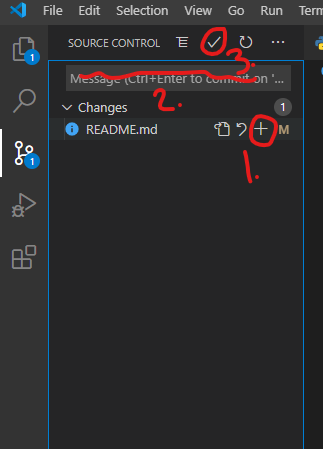

# Python_Practice

---

## Before you start coding

Before you begin make sure that you pull the code from the repo on github.

To Pull:

- Use the third tab down and hit the three dots and select pull.
- The second option is to hit Control + Shift + P and type pull.

---

# Begin here after you pull the code

- [] In the Variable_Naming folder there is a file called variable_practice.py. Start there, there are some excercies in it to get you going on variable naming and use.

- [] Once you are done with variable naming move on to the functions folder. In there are some functions that you will have to write the logic inside of in order to pass a se of tests that I have written.

- [] WIP

---

## After you complete and code that you inted to work on for the day

Make sure that you Stage, Commit and push all you code to GitHub.

To Push:

1. Go to the third tab down and there will be changes shown
2. If there is a single change clik the plus next to the change if there are multiple changes click the pluse next to chnages to stage them all.
3. Add a commit message. This is just a brief message to let me or any other developers know what you worked on.
4. Click the check mark above the commit message to commit the changes.
5. Then either click the 3 dots next to the check mark and select push | Alternatively COntro + Shift + P then typing in Push will get you the same results.

---
